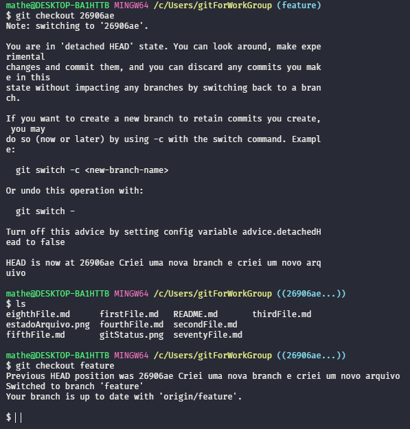

# Navegar no histórico
Permite ver como um arquivo ou todo o repositório estava em um determiniado commit.
```
git checkout <commit><file>
````

Para voltar para o ultimo commit:
_Nesse teste eu estou na branch feature então eu usarei o caminho para voltar para o topo do mesmo_
```
git checkout feature
``` 



## Git checkout (revisão)
Altera o repositório para o estado daquele commit.
> Útil para fazer testes antes e depois de alterações.
```
git checkout <commit>
```
Para voltar o repositório no último commit.
```
git checkout master
```