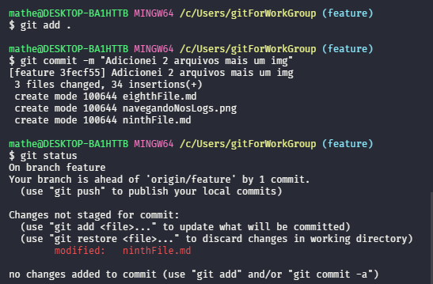
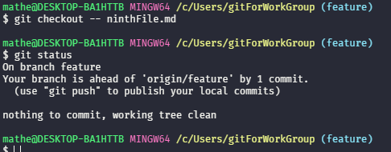

# Desfazenhdo alterações
Irá desfazer todas as alterações que não esteja no stage desde o último commit.
```
git checkout -- <path_or_file>
```

Desfazer as alterações desde o último commit incluindo o Stage.
> Visualize assim, "- fiz o 'git add .' e 'git commit -m ..'
```
git checkout HEAD -- <path_file>
```


---

