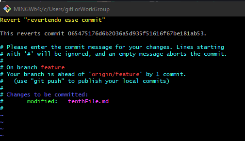
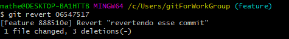

# Git Revert
<<<<<<< HEAD

=======
# Git Revert
>>>>>>> master
Irá criar um novo commit que desfaz as alterações do commit especificado.
```
git revert <commit>
```
> Útil para desfazer um commit antigo.





_pronto só ser feliz se fizer uma infelicidade._

---

# Git reset
Restar o repositório para um determinado commit.
```
git reset <commit>
git reset HEAD~1 (o numero informa quantos commits quer voltar)
```

Resetar e remover todas as alterações.
> Cuidado ao usar desfazer últimos commits.
-> Útil para desfazer últimos commits.
```
git reset --hard <commit>
```
<<<<<<< HEAD
teste para revert
=======
>>>>>>> master
