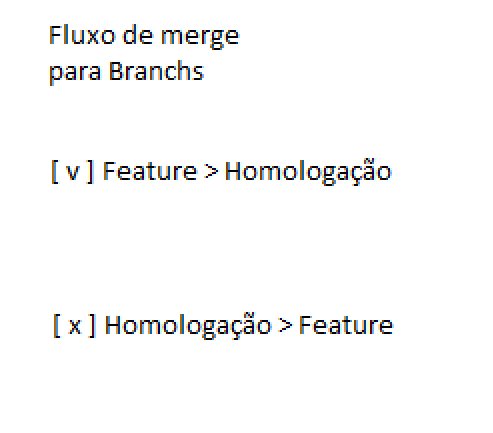

# Erro
> Arquivo destinado para demonstração de erros que não podemos comenter ao fazer merge.

_A branch de feature (onde a equipe estará sempre trabalhando), é a mais atualizada, por tanto, não posso fazer merge estando nela, mas sim estando na branch de homologação puxando as atualizações dela_

## Descobrimos que não faz diferença